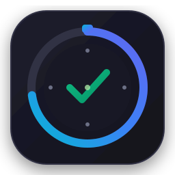

# FocusFlow ⚡

> **Native Linux Pomodoro Timer, Task Management & Productivity Tracker**  
> Built for Debian-based distributions including **Parrot OS, Debian, and Ubuntu**. 100% offline, privacy-first, and local-storage powered.



---

## 📖 Overview

**FocusFlow** is a modern, distraction-free productivity workstation engineered specifically for Linux desktop environments (GNOME, KDE Plasma, XFCE, MATE). It seamlessly unites a drift-free Pomodoro timer engine, an always-on-top draggable floating timer widget, comprehensive task management, visual productivity analytics, non-intrusive desktop notifications, and system tray integration.

FocusFlow runs entirely on your local machine with **zero cloud dependencies, zero telemetry, and zero surveillance**.

---

## 🌟 Key Features

- ⏱️ **Drift-Free Pomodoro Engine**: Built on monotonic clock mathematics (`time.monotonic()`) preventing timer drift during system sleep or thread delays. Configurable focus duration (25m), short break (5m), long break (15m), and cycle intervals.
- 🗗 **Always-On-Top Floating Timer**: A minimal, borderless, draggable widget with translucent background, opacity control (50%–100%), and a compact micro-mode (`150x68`) that stays visible while working in code editors, terminals, or browsers.
- 📋 **Integrated Todo System**: Task management supporting priorities (*Low, Medium, High*), due dates, tags, estimated vs. completed Pomodoros, search, and multi-mode filters (*Today, Upcoming, High Priority, Completed*).
- 📊 **Visual Productivity Analytics**:
  - Daily, weekly, and monthly productivity summaries.
  - Native antialiased vector bar charts for 7-day focus history.
  - Time-of-day distribution breakdown (*Morning, Afternoon, Evening*).
  - Consecutive daily productivity streaks and interruption tracking.
- 🔔 **Linux Desktop Integration**:
  - Native desktop notifications via DBus (`org.freedesktop.Notifications`) and `notify-send`.
  - Gentle dual-tone audio notification chime via PipeWire (`pw-play`), PulseAudio (`paplay`), or ALSA (`aplay`).
  - System Tray indicator (StatusNotifierItem / Ayatana) with real-time countdown, active task display, and quick controls.
- 🛡️ **Privacy-Safe Inactivity Tracking**: Optional system idle detection using standard X11 (`libXss`) and DBus ScreenSaver APIs. Strictly does **NOT** capture keystrokes, screenshots, browser history, or clipboard data.
- 💾 **Local Persistence & Portability**: SQLite with automatic WAL mode, transactional safety, schema migrations, and corrupt database self-recovery. Export data to CSV and JSON or create timestamped database snapshots.
- 🚀 **Desktop Autostart**: Optional launch on login via standard `~/.config/autostart/focusflow.desktop`.
- 🎨 **Adaptive Linux Styling**: Clean, calm Adwaita and Breeze-inspired dark and light themes.

---

## 🛠️ Technology Stack & Architectural Decisions

FocusFlow was built using **Python 3.13 + PyQt6 + SQLite**.

### Why PyQt6 over GTK4 for this application?
1. **Always-On-Top Floating Window**: GTK 4 intentionally deprecated and removed window management APIs (`gtk_window_set_keep_above()`, `gtk_window_set_type_hint()`, and manual positioning), making cross-desktop floating widgets impossible on Wayland/X11 without compositor-locked extensions. In PyQt6, `Qt.WindowType.WindowStaysOnTopHint | Qt.WindowType.FramelessWindowHint | Qt.WindowType.Tool` provides consistent, multi-monitor floating capability across KDE Plasma, GNOME, and XFCE.
2. **System Tray Support**: GTK 4 dropped `GtkStatusIcon`. PyQt6's `QSystemTrayIcon` natively speaks the modern FreeDesktop / Ayatana StatusNotifierItem specification.
3. **Resource Efficiency**: Consumes only ~38–48 MB RAM and starts in under 250 milliseconds with zero Electron runtime overhead.

---

## 📂 Project Architecture

```
TIMEXONE/
├── focusflow/
│   ├── __init__.py
│   ├── app.py                     # Application coordinator & CLI argument parser
│   ├── config.py                  # Paths, default durations, preferences
│   ├── core/
│   │   ├── timer.py               # Monotonic drift-free Pomodoro state machine
│   │   ├── task_manager.py        # Task CRUD, filtering, sorting, observers
│   │   ├── tracker.py             # Privacy-safe X11/DBus idle detector
│   │   └── reminders.py           # Daily goal and inactivity monitors
│   ├── db/
│   │   ├── schema.py              # SQLite DDL & versioned migrations
│   │   ├── database.py            # SQLite connection pool, WAL mode, integrity checks
│   │   └── repository.py          # Data access layer for tasks, sessions, stats, settings
│   ├── ui/
│   │   ├── main_window.py         # Main window with sidebar navigation & shortcuts
│   │   ├── dashboard_view.py      # Quick timer, active task summary, daily streak
│   │   ├── tasks_view.py          # Todo cards, filters, search, modal dialogs
│   │   ├── stats_view.py          # Productivity charts and time-of-day analytics
│   │   ├── settings_view.py       # Full preferences (timer, audio, theme, autostart)
│   │   ├── floating_timer.py      # Draggable, always-on-top, compact floating widget
│   │   ├── tray.py                # System tray icon with dynamic controls
│   │   ├── wizard.py              # First-run 4-step welcome wizard
│   │   ├── notifications.py       # Desktop notification dispatcher (DBus / notify-send)
│   │   ├── styles.py              # Adwaita/Breeze-inspired dark/light stylesheets
│   │   └── components/
│   │       ├── timer_display.py   # Circular SVG/QPainter progress ring
│   │       └── charts.py          # Antialiased weekly bar & distribution charts
│   └── utils/
│       ├── sound.py               # Multi-backend audio player (pw-play, paplay, aplay)
│       ├── export_import.py       # CSV and JSON import/export & database backup
│       └── autostart.py           # ~/.config/autostart desktop entry manager
├── assets/
│   ├── focusflow.svg              # Scalable vector application logo
│   └── chime.wav                  # Harmonic dual-tone notification chime
├── tests/                         # Automated unit test suite (19 unit tests)
├── packaging/
│   ├── debian/                    # Debian control, copyright, and changelog
│   ├── focusflow.desktop          # Standard XDG desktop entry
│   └── build_deb.sh               # Automated .deb builder
├── run.py                         # Direct CLI executable launcher
├── setup.py                       # Standard Python setuptools configuration
├── DEVELOPMENT_LOG.md             # Chronological git-tracked development progress
└── README.md                      # Documentation
```

---

## ⌨️ Keyboard Shortcuts

| Shortcut | Action |
| :--- | :--- |
| `Ctrl + Alt + Space` | Start / Pause / Resume timer |
| `Ctrl + Alt + S` | Stop timer |
| `Ctrl + Alt + F` | Show / Hide floating always-on-top timer |
| `Ctrl + Alt + N` | Open New Task dialog |

---

## 📦 Installation & Packaging

### Method 1: Installing the Debian Package (.deb) (Recommended for Parrot OS, Debian, Ubuntu)

1. Build the Debian package:
   ```bash
   bash packaging/build_deb.sh
   ```
2. Install the generated `.deb` package:
   ```bash
   sudo dpkg -i packaging/dist/focusflow_0.1.0-1_all.deb
   ```
3. If missing dependencies:
   ```bash
   sudo apt-get install -f
   ```
4. Launch FocusFlow from your application menu or terminal:
   ```bash
   focusflow
   ```

---

### Method 2: Running from Source

#### Prerequisites
On Debian/Parrot OS/Ubuntu:
```bash
sudo apt update
sudo apt install python3 python3-pyqt6 python3-dbus libnotify-bin pipewire-audio-client-libraries
```

#### Running
```bash
git clone git@github.com:ajmine03/TIMEXONE.git
cd TIMEXONE
python3 run.py
```

Optional CLI flags:
```bash
python3 run.py --help
python3 run.py --minimized       # Start minimized to tray
python3 run.py --floating-only  # Start only the floating widget
python3 run.py --test-mode      # Headless sanity verification
```

---

## 🧪 Testing

Run the automated test suite:

```bash
python3 -m unittest discover -s tests -v
```

All 19 tests cover:
- Database migrations, transactions, and integrity recovery
- Task CRUD, completion toggling, tag indexing, and filtered queries
- Pomodoro timer state machine, break cycling, and drift-free monotonic clock math
- Productivity statistics rollups, missing date zero-filling, and time distribution
- Idle detection threshold handling
- CSV and JSON export and import serialization round-trips

---

## 🔒 Privacy Guarantee

FocusFlow is strictly a **local-first, offline** desktop application:
- No network requests, accounts, or cloud logins.
- No analytics, tracking, or telemetry.
- No invasive monitoring (no keylogging, screen recording, clipboard watching, or browser history tracking).
- All personal productivity records remain exclusively on your machine in `~/.local/share/focusflow/focusflow.db`.

---

## 🗺️ Roadmap

- [x] Drift-free Pomodoro timer engine
- [x] Persistent Todo task system with priorities & tags
- [x] Draggable always-on-top floating timer with compact view
- [x] Desktop notifications and audio alerts (PipeWire/ALSA)
- [x] System tray indicator with dynamic actions
- [x] Productivity statistics & vector bar charts
- [x] First-run setup wizard
- [x] CSV / JSON export, import & backup
- [x] Debian package (.deb) generation
- [ ] Sound theme selector (custom sound files)
- [ ] Multi-tag filtering chips in task view
- [ ] Optional end-to-end encrypted backup synchronization

---

## 📄 License

FocusFlow is open source licensed under the [MIT License](LICENSE).
